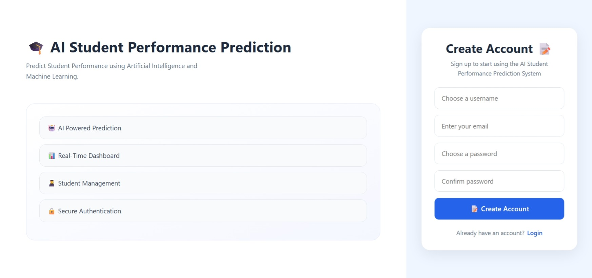
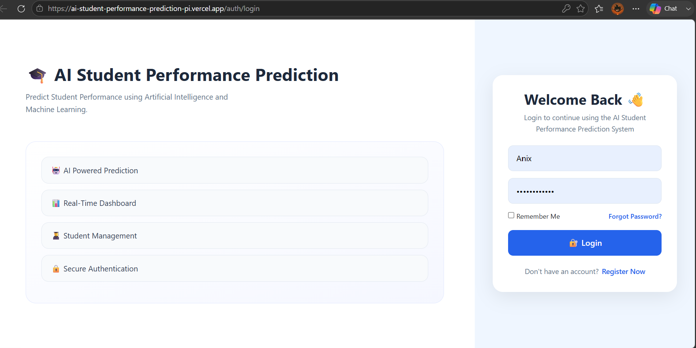
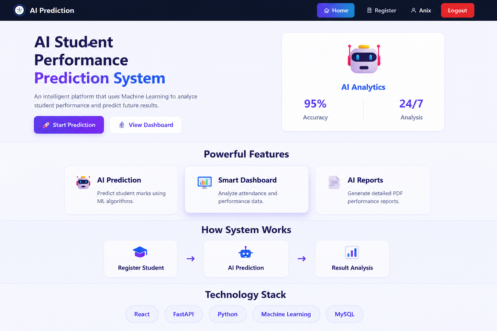
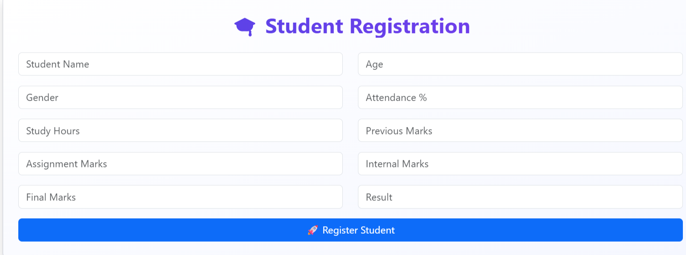
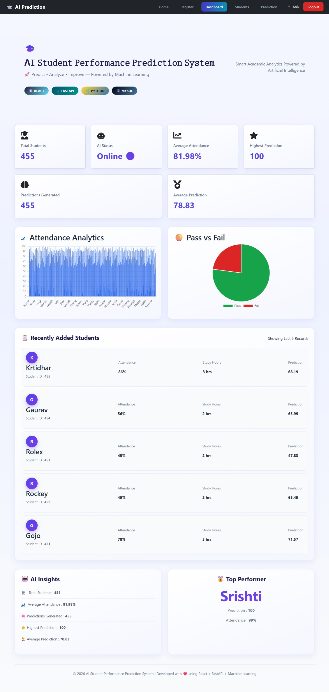
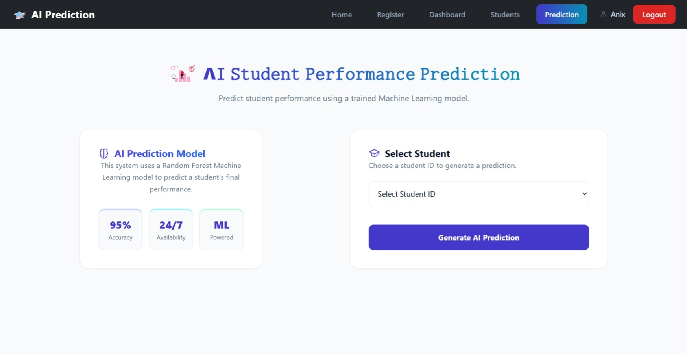
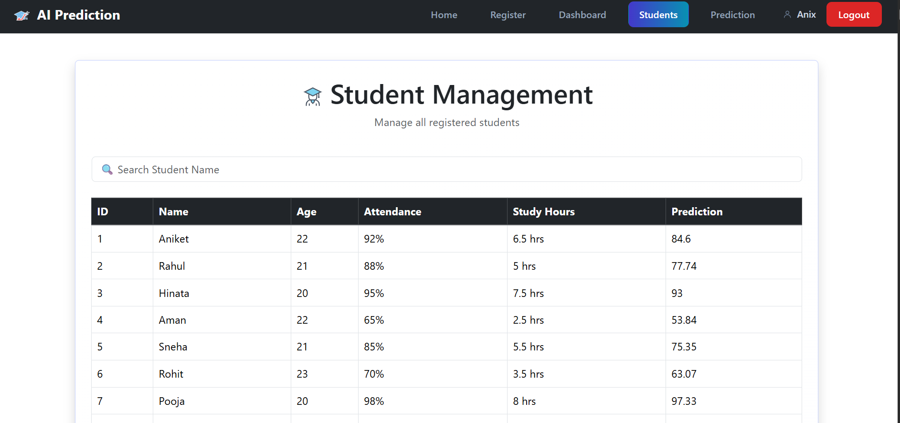
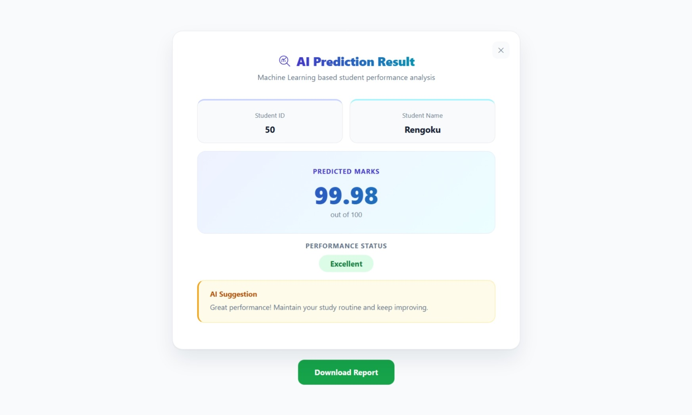

<div align="center">


# AI Student Performance Prediction System
### 🚀 Predict • Analyze • Improve — Powered by Machine Learning


</div>

---

An AI-powered web application that predicts student academic performance using Machine Learning and provides an interactive dashboard for student management, analytics, and performance reporting.

---

## 📖 Project Description

The AI Student Performance Prediction System is a full-stack web application designed to help educational institutions predict students' academic performance using Artificial Intelligence and Machine Learning.

The system collects academic information such as attendance, study hours, previous marks, assignment marks, and internal marks. Using a trained Random Forest Machine Learning model, it predicts the student's expected final marks.

The application also includes a modern dashboard for student registration, data management, prediction analysis, charts, and downloadable reports.

This project demonstrates the integration of Machine Learning with a React frontend, FastAPI backend, and MySQL database to build a real-world educational analytics platform.
---

## ✨ Features

- 👨‍🎓 Student Registration and Management
- 🤖 AI-Based Student Performance Prediction
- 📊 Interactive Dashboard with Charts
- 📈 Student Performance Analytics
- 📋 Student Records Management
- 📄 Downloadable Prediction Reports
- 🔍 Search and Filter Students
- 💻 Responsive User Interface
- ⚡ FastAPI REST API Integration
- 🗄️ MySQL Database Integration
- 🌐 Modern React + Vite Frontend
---

# 🛠️ Tech Stack

## Frontend
- React.js
- Vite
- Bootstrap 5
- CSS3
- Axios
- React Router DOM
- Recharts

## Backend
- FastAPI
- SQLAlchemy
- Pydantic
- Uvicorn

## Machine Learning
- Python
- Scikit-learn
- Random Forest Regressor
- Pandas
- NumPy
- Joblib

## Database
- MySQL

## Version Control
- Git
- GitHub

## Development Tools
- Visual Studio Code
- Postman
---

# 📁 Project Structure

```text
AI_Student_Performance_Prediction/
│
├── Backend/
│   ├── app/
│   ├── database/
│   │   ├── __init__.py
│   │   └── database.py
│   ├── Dataset/
│   │   ├── student_performance.csv
│   │   ├── student_performance_backup.csv
│   │   └── add_noise.py
│   ├── models/
│   │   ├── base.py
│   │   ├── student.py
│   │   └── user.py
│   ├── routes/
│   │   ├── auth.py
│   │   └── student.py
│   ├── schemas/
│   │   ├── predict.py
│   │   ├── student.py
│   │   └── user.py
│   ├── services/
│   ├── train_model/
│   │   └── train.py
│   ├── ml_model/
│   │   └── model_loader.py
│   ├── uploads/
│   ├── utils/
│   ├── .env
│   ├── .gitignore
│   ├── create_admin.py
│   ├── create_demo_user.py
│   ├── main.py
│   ├── requirements.txt
│   └── student_model.pkl
│
├── Frontend/
│   ├── src/
│   ├── public/
│   ├── package.json
│   └── vite.config.js
│
└── README.md
```
---

# 🤖 Machine Learning Model

This project uses the **Random Forest Regressor** algorithm from **Scikit-learn** to predict students' final academic performance based on their academic records.

## Input Features

The model is trained using the following student attributes:

- Age
- Attendance (%)
- Study Hours
- Previous Marks
- Assignment Marks
- Internal Marks

## Output

The trained model predicts the student's **Expected Final Marks**.

## Model Workflow

1. Load the student dataset.
2. Preprocess and clean the data.
3. Select input features and target variable.
4. Train the Random Forest Regressor model.
5. Save the trained model using Joblib.
6. Load the model in the FastAPI backend.
7. Generate predictions for new student records.

## Libraries Used

- Scikit-learn
- Pandas
- NumPy
- Joblib

## Why Random Forest?

- High prediction accuracy
- Handles non-linear relationships
- Reduces overfitting
- Works well with structured datasets
- Provides stable and reliable predictions
---
## 📊 Model Performance

The model was evaluated on a held-out test set (80/20 train-test split):

| Metric | Score |
|--------|-------|
| R² Score | 0.89 |
| Mean Absolute Error (MAE) | ±4.48 marks |

**Feature Importance:**
- Assignment Marks — 43.1%
- Previous Marks — 22.5%
- Internal Marks — 21.3%
- Attendance — 6.7%
- Study Hours — 5.9%
- Age — 0.4%
---
# ⚙️ System Architecture

```text
                    +----------------------+
                    |      React.js UI     |
                    |   (Frontend - Vite)  |
                    +----------+-----------+
                               |
                               | REST API (Axios)
                               ▼
                    +----------------------+
                    |   FastAPI Backend    |
                    |  (Business Logic)    |
                    +----------+-----------+
                               |
               +---------------+---------------+
               |                               |
               ▼                               ▼
      +------------------+           +----------------------+
      | Machine Learning |           |     MySQL Database   |
      | Random Forest    |           | Student Information  |
      +------------------+           +----------------------+
               |
               ▼
      +----------------------+
      | Prediction Result    |
      | Dashboard & Reports  |
      +----------------------+
```

## 🔄 Application Workflow

1. User enters student details through the React frontend.
2. The frontend sends the data to the FastAPI backend using REST APIs.
3. The backend validates the input data.
4. The trained Random Forest model processes the input.
5. The predicted final marks are generated.
6. Prediction results are stored in the MySQL database.
7. The dashboard displays analytics, charts, and reports.
---

# 🚀 Installation Guide

An intelligent platform that uses Machine Learning to analyze student performance and predict future academic results.

## 🌐 Live Demo

- **Frontend (Vercel):** https://ai-student-performance-prediction-pi.vercel.app
- **Backend API (Render):** https://anix-ai-student-performance-prediction.onrender.com
- **API Documentation (Swagger UI):** https://anix-ai-student-performance-prediction.onrender.com/docs

---

## 🚀 Installation Guide (Run Locally)

Follow these steps to run the project on your local machine.

### 1️⃣ Clone the Repository

```bash
git clone https://github.com/YOUR_GITHUB_USERNAME/AI_Student_Performance_Prediction.git
```

Replace `YOUR_GITHUB_USERNAME` with your actual GitHub username.

### 2️⃣ Backend Setup

Navigate to the backend folder:

```bash
cd Backend
```

Create a virtual environment:

```bash
python -m venv .venv
```

Activate the virtual environment:

**Windows**
```bash
.venv\Scripts\activate
```

**Linux / macOS**
```bash
source .venv/bin/activate
```

Install dependencies:

```bash
pip install -r requirements.txt
```

Start the FastAPI server:

```bash
uvicorn main:app --reload
```

Backend will run on:

### 3️⃣ Frontend Setup

Open another terminal and navigate to the frontend folder:

```bash
cd Frontend
```

Install dependencies:

```bash
npm install
```

Create a `.env` file inside the `Frontend` folder and add:

Start the React application:

```bash
npm run dev
```

Frontend will run on:

### 4️⃣ Database Setup

- Install MySQL Server.
- Create a database named:
- Update your database configuration in the backend `.env` file.
- Import the student dataset if required.

### 5️⃣ Access the Application (Local)

- **Frontend:** http://localhost:5173
- **Backend API:** http://127.0.0.1:8000
- **FastAPI Documentation:** http://127.0.0.1:8000/docs

---

## ☁️ Deployment

This project is deployed using:

- **Frontend:** [Vercel](https://vercel.com) — deployed from the `Frontend` folder as the root directory.
- **Backend:** [Render](https://render.com) — deployed as a Python web service running the FastAPI app via `uvicorn`.

Environment variables used in production:

| Platform | Variable | Purpose |
|----------|----------|---------|
| Vercel | `VITE_API_URL` | Points frontend to the live Render backend URL |
| Render | Database credentials | MySQL connection details for production database |

---

## 📡 API Endpoints

The backend is built using FastAPI and provides RESTful APIs for managing students and predicting academic performance.

| Method | Endpoint | Description |
|--------|----------|-------------|
| POST | `/register` | Register a new student |
| GET | `/students` | Retrieve all registered students |
| GET | `/student/{id}` | Get details of a specific student |
| POST | `/predict` | Predict student final marks using the AI model |
| GET | `/download-report/{student_id}` | Download the student's prediction report |

## 🔍 API Documentation

FastAPI automatically generates interactive API documentation.

- **Swagger UI:** https://anix-ai-student-performance-prediction.onrender.com/docs
- **ReDoc:** https://anix-ai-student-performance-prediction.onrender.com/redoc

## 📥 Example Prediction Request

```json
{
  "age": 20,
  "attendance": 92,
  "study_hours": 5,
  "previous_marks": 81,
  "assignment_marks": 85,
  "internal_marks": 78
}
```

## 📤 Example Prediction Response

```json
{
  "predicted_marks": 84.23
}
```
# 📝 Create Account (Signup)



---
# 🔐 Login



---

# 📸 Project Screenshots

## 🏠 Home Page



---

## 👨‍🎓 Student Registration



---

## 📊 Dashboard



---

## 🤖 Prediction Page



---

## 👥 Student Management



---

## 📄 Prediction Report


---

# 🚀 Future Scope

The AI Student Performance Prediction System can be enhanced with several advanced features in future releases:

- 🤖 Deep Learning models for improved prediction accuracy.
- 📱 Mobile application for Android and iOS.
- 👨‍🏫 Faculty and Student Login Portal.
- 📧 Email and SMS notifications for performance reports.
- 📊 Advanced analytics and interactive visualizations.
- ☁️ Cloud deployment using AWS, Azure, or Google Cloud.
- 🔒 Role-based authentication and authorization.
- 📚 Personalized learning recommendations based on AI predictions.
- 📈 Real-time performance monitoring dashboard.
- 🌍 Multi-language support for wider accessibility.
---
## 🔑 Demo Login Credentials

A read-only demo account is available so reviewers can explore the app without registering.

| Username    | Password       |
| ----------- | -------------- |
| **demo**    | **Demo@1234**  |

> ⚠️ **Note:** This is a dedicated demo account with limited/read-only permissions, seeded with sample data only. It is not linked to any real user or production data.
---

# 👨‍💻 Author

**Aniket Singh**

🎓 Master of Computer Applications (MCA)

💡 Passionate about Artificial Intelligence, Machine Learning, and Full Stack Web Development.

## 📬 Connect with Me

- GitHub: [(https://github.com/anixlevi/AI_Student_Performance_Prediction)]
- LinkedIn: [(https://www.linkedin.com/in/aniket-singh-439819389/)]
- Email: an1ket0s1ngh000@gmail.com
