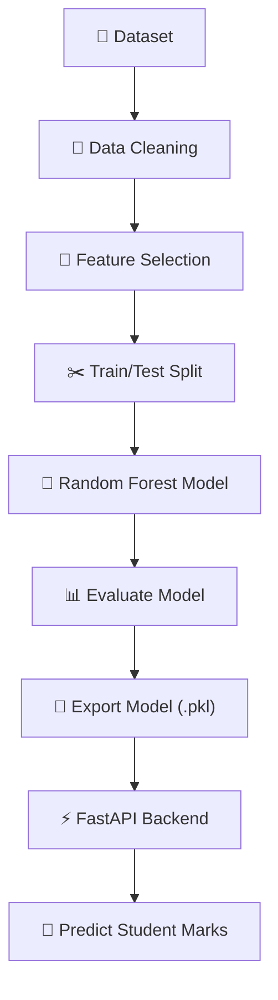
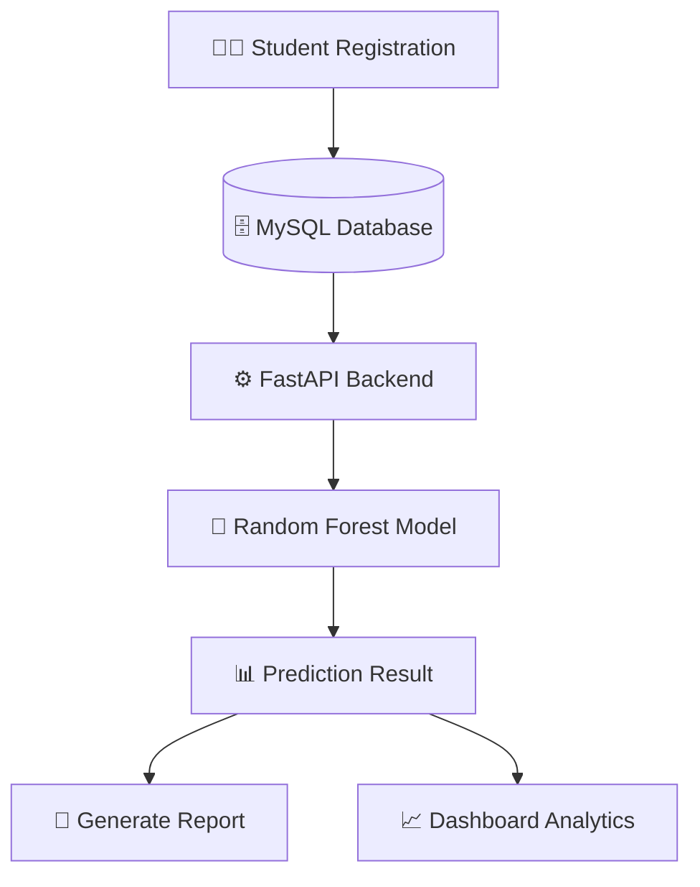
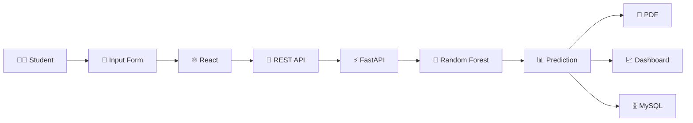
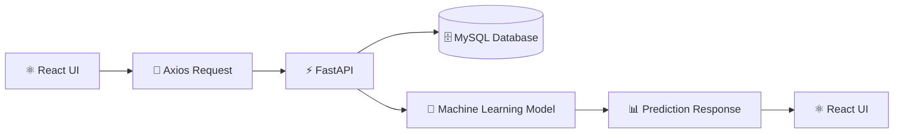

<div align="center">


# Λ𝙸 𝚂𝚝𝚞𝚍𝚎𝚗𝚝 𝙿𝚎𝚛𝚏𝚘𝚛𝚖𝚊𝚗𝚌𝚎 𝙿𝚛𝚎𝚍𝚒𝚌𝚝𝚒𝚘𝚗 𝚂𝚢𝚜𝚝𝚎𝚖

### 🚀 Predict • Analyze • Improve using Machine Learning

<p align="center">


</p>

### 💡 A Full Stack AI-powered Educational Analytics Platform

Predict student academic performance using Machine Learning, manage student records, visualize analytics, and generate intelligent reports through an interactive dashboard.

</div>

---

# 🌍 Live Demo

| Application | Link |
|-------------|------|
| 🌐 Frontend | https://ai-student-performance-prediction-pi.vercel.app |
| ⚙️ Backend API | https://anix-ai-student-performance-prediction.onrender.com |
| 📘 Swagger API Docs | https://anix-ai-student-performance-prediction.onrender.com/docs |

---

# 📖 Project Description

The **AI Student Performance Prediction System** is a Full Stack Machine Learning web application developed to help educational institutions analyze and predict student academic performance.

The system collects important academic information such as attendance, study hours, previous marks, assignment marks, and internal marks. A trained **Random Forest Regression** model processes this information to predict the student's expected final marks.

Apart from AI prediction, the application provides a complete student management solution featuring student registration, authentication, dashboards, analytics, downloadable reports, and performance visualization.

This project demonstrates how **Machine Learning**, **FastAPI**, **React**, and **MySQL** can be integrated into a real-world educational analytics platform.

---

# ⭐ Project Highlights

- 🤖 AI Powered Student Performance Prediction
- 📊 Interactive Dashboard & Analytics
- 👨‍🎓 Complete Student Management System
- ⚡ FastAPI REST API
- 🎯 Random Forest Regression Model
- 📄 Downloadable Prediction Reports
- 🔍 Search & Filter Students
- 📱 Responsive React Interface
- 🗄️ MySQL Database Integration
- ☁️ Live Deployment using Vercel & Render

---

# ✨ Features

- 👨‍🎓 Student Registration
- 🔐 Secure Login System
- 📊 Dashboard with Charts
- 🤖 AI Prediction Module
- 📈 Performance Analytics
- 📋 Student Management
- 🔍 Search & Filter Records
- 📄 PDF Report Generation
- 📉 Prediction History
- 📱 Fully Responsive Design
- ⚡ REST API Integration
- ☁️ Cloud Deployment

---

# 🛠️ Tech Stack

## 🎨 Frontend

- React.js
- Vite
- Bootstrap 5
- CSS3
- Axios
- React Router DOM
- Recharts

---

## ⚙️ Backend

- FastAPI
- SQLAlchemy
- Pydantic
- Uvicorn

---

## 🤖 Machine Learning

- Python
- Scikit-learn
- Random Forest Regressor
- Pandas
- NumPy
- Joblib

---

## 🗄️ Database

- MySQL

---

## 💻 Development Tools

- Visual Studio Code
- Postman
- Git
- GitHub

---
# 📁 Project Structure

```text
AI_Student_Performance_Prediction/
│
├── Backend/
│   ├── app/
│   ├── database/
│   ├── Dataset/
│   ├── models/
│   ├── routes/
│   ├── schemas/
│   ├── services/
│   ├── train_model/
│   ├── ml_model/
│   ├── uploads/
│   ├── utils/
│   ├── .env
│   ├── requirements.txt
│   ├── main.py
│   └── student_model.pkl
│
├── Frontend/
│   ├── public/
│   ├── src/
│   ├── package.json
│   └── vite.config.js
│
├── screenshots/
│
└── README.md
```

---

# 📦 Project Modules

| Module | Description |
|----------|-------------|
| 🔐 Authentication | User Login & Authentication |
| 👨‍🎓 Student Management | Register, Update & Manage Students |
| 🤖 AI Prediction | Predict Student Final Marks |
| 📊 Dashboard | Charts & Student Analytics |
| 📄 Report Generation | Download Student Prediction Report |
| 🔍 Search & Filter | Find Student Records Instantly |
| ⚡ REST API | FastAPI Backend Services |
| 🧠 Machine Learning | Random Forest Prediction Engine |

---

# 🤖 Machine Learning Model

The prediction engine is built using the **Random Forest Regressor** algorithm provided by **Scikit-learn**.

The model learns patterns from historical student academic records and predicts the expected final marks for new students.

Unlike traditional statistical models, Random Forest combines multiple decision trees to produce more stable and accurate predictions while minimizing overfitting.

---

## 🎯 Input Features

The prediction model uses the following academic attributes:

| Feature | Description |
|----------|-------------|
| Age | Student Age |
| Attendance | Attendance Percentage |
| Study Hours | Average Daily Study Hours |
| Previous Marks | Previous Examination Marks |
| Assignment Marks | Assignment Performance |
| Internal Marks | Internal Assessment Marks |

---

## 🎯 Target Variable

The trained Machine Learning model predicts:

> **Expected Final Marks**

---

# ⚙️ Machine Learning Workflow


# 📂 Dataset Information

The project uses a structured dataset containing academic records of students.

| Property | Value |
|-----------|-------|
| Dataset Type | CSV |
| Total Records | 50 Students |
| Input Features | 6 |
| Target Variable | Final Marks |
| Missing Values | None |
| Train/Test Split | 80% / 20% |

---
# Dataset Columns

<p align="center">


<br>


<br>


</p>


# 📊 Model Performance

The Machine Learning model was evaluated using an 80/20 Train-Test split.

| Metric | Score |
|----------|--------|
| Algorithm | Random Forest Regressor |
| R² Score | 0.89 |
| Mean Absolute Error (MAE) | ±4.48 Marks |

---

## 📈 Feature Importance

| Feature | Importance |
|----------|------------|
| Assignment Marks | 43.1% |
| Previous Marks | 22.5% |
| Internal Marks | 21.3% |
| Attendance | 6.7% |
| Study Hours | 5.9% |
| Age | 0.4% |

---

# 🎯 Example Prediction

### Input

| Feature | Value |
|----------|------:|
| Age | 20 |
| Attendance | 92% |
| Study Hours | 5 |
| Previous Marks | 81 |
| Assignment Marks | 85 |
| Internal Marks | 78 |

↓

### AI Output

```text
Predicted Final Marks

84.23
```

The predicted marks are stored in the database and displayed instantly on the dashboard.

---

# 🏗️ System Architecture

```text
                     +-----------------------+
                     |     React Frontend    |
                     |      (Vite + React)   |
                     +-----------+-----------+
                                 |
                                 |
                          Axios REST API
                                 |
                                 ▼
                    +------------------------+
                    |    FastAPI Backend     |
                    | Business Logic & APIs  |
                    +-----------+------------+
                                |
                +---------------+---------------+
                |                               |
                ▼                               ▼
      +----------------------+      +----------------------+
      | Machine Learning     |      |   MySQL Database     |
      | Random Forest Model  |      | Student Information  |
      +----------------------+      +----------------------+
                |
                ▼
      +------------------------+
      | Prediction Result      |
      | Dashboard & Reports    |
      +------------------------+
```

---

# 🔄 Application Workflow


---
 # Why Random Forest?
...
# 🚀 Quick Start

- ✅ High Prediction Accuracy
- ✅ Reduces Overfitting
- ✅ Handles Complex Educational Data
- ✅ Fast & Reliable Predictions

---

## 🚀 Quick Start

### 1️⃣ Clone Repository

```bash
git clone https://github.com/anixlevi/AI_Student_Performance_Prediction.git
cd AI_Student_Performance_Prediction
```

## 2️⃣ Backend

```bash
cd Backend

python -m venv .venv
.venv\Scripts\activate

pip install -r requirements.txt

uvicorn main:app --reload
```

## 3️⃣ Frontend

```bash
cd Frontend

npm install

npm run dev
```

## 4️⃣ Configure Environment

### Backend (.env)

```env
DB_HOST=localhost
DB_PORT=3306
DB_NAME=student_prediction_db
DB_USER=root
DB_PASSWORD=your_password
```

### Frontend (.env)

```env
VITE_API_URL=http://127.0.0.1:8000
```

---

# 🌍 Application URLs

| Service | URL |
|---------|-----|
| 🌐 Frontend | http://localhost:5173 |
| ⚙️ Backend | http://127.0.0.1:8000 |
| 📘 Swagger API | http://127.0.0.1:8000/docs |

---

# ☁️ Deployment

| Component | Platform |
|-----------|----------|
| Frontend | Vercel |
| Backend | Render |
| Database | MySQL |

### 🔗 Live Demo

- 🌐 Frontend: https://ai-student-performance-prediction-pi.vercel.app
- ⚙️ Backend: https://anix-ai-student-performance-prediction.onrender.com
- 📘 API Docs: https://anix-ai-student-performance-prediction.onrender.com/docs

---
---

# 🔐 Environment Variables

## Frontend (.env)

```env
VITE_API_URL=https://anix-ai-student-performance-prediction.onrender.com
```

---

## Backend (.env)

```env
DB_HOST=localhost
DB_PORT=3306
DB_NAME=student_prediction_db
DB_USER=root
DB_PASSWORD=your_password
```

---

# 📡 REST API Endpoints

| Method | Endpoint | Description |
|----------|----------|-------------|
| POST | `/register` | Register New Student |
| POST | `/login` | User Login |
| GET | `/students` | Fetch All Students |
| GET | `/student/{id}` | Student Details |
| PUT | `/student/{id}` | Update Student |
| DELETE | `/student/{id}` | Delete Student |
| POST | `/predict` | Predict Final Marks |
| GET | `/download-report/{id}` | Download Student Report |

---

# 📘 API Documentation

FastAPI automatically generates interactive documentation.

### Swagger UI

https://anix-ai-student-performance-prediction.onrender.com/docs

### ReDoc

https://anix-ai-student-performance-prediction.onrender.com/redoc

---

# 📥 Sample Prediction Request

```json
{
  "age": 20,
  "attendance": 92,
  "study_hours": 5,
  "previous_marks": 81,
  "assignment_marks": 85,
  "internal_marks": 78
}
```

---

# 📤 Sample Prediction Response

```json
{
  "predicted_marks": 84.23
}
```

---

# 🔄 Prediction Pipeline


# 📡 API Flow


---
# 📸 Application Screenshots

The following screenshots showcase the key modules of the application.

---

## 🏠 Home Page

The landing page provides an overview of the AI Student Performance Prediction System along with its features and workflow.


---

## 📝 Student Registration

Students can be registered by entering academic information into an easy-to-use form.


---

## 🔐 Login Page

Secure authentication allows authorized users to access the dashboard.


---

## 👤 User Signup

New users can create an account before accessing the application.


---

## 📊 Dashboard

The dashboard displays overall student statistics, charts, prediction summaries, and performance analytics.

Features include:

- Total Students
- Average Marks
- Attendance Overview
- Top Performing Students
- Interactive Charts


---

## 🤖 AI Prediction

The prediction module uses the trained Random Forest model to estimate a student's expected final marks.


---

## 👨‍🎓 Student Management

Manage student records with powerful search and filtering capabilities.


---

## 📄 Prediction Report

Generate and download prediction reports for future reference.


---

# 🎯 Project Achievements

✅ Full Stack Web Application

✅ Machine Learning Integration

✅ AI-Based Prediction System

✅ FastAPI REST APIs

✅ Responsive React Interface

✅ MySQL Database

✅ Interactive Dashboard

✅ PDF Report Generation

✅ Live Deployment

---

# 🚀 Future Enhancements

The project can be further enhanced with modern AI and cloud technologies.

### Artificial Intelligence

- Explainable AI (SHAP / LIME)
- Deep Learning Models
- Ensemble Learning
- Personalized Learning Recommendations

---

### Security

- JWT Authentication
- Password Encryption
- Role-Based Authorization
- Two-Factor Authentication

---

### Dashboard

- Real-Time Analytics
- Advanced Filtering
- Performance Comparison
- Student Ranking System

---

### Cloud

- Docker Containerization
- GitHub Actions CI/CD
- AWS Deployment
- Azure Deployment
- Google Cloud Deployment

---

### Additional Features

- Email Notifications
- SMS Alerts
- Mobile Application
- Multi-language Support
- Attendance Tracking
- Teacher Portal
- Student Portal

---

# 🔑 Demo Login Credentials

A demo account has been provided for reviewers and recruiters.

| Username | Password |
|----------|----------|
| **demo** | **Demo@1234** |

> **Note:** This account contains sample data only and has limited access.

---

# 📊 Project Statistics

| Category | Details |
|----------|----------|
| Frontend | React + Vite |
| Backend | FastAPI |
| Machine Learning | Random Forest Regressor |
| Database | MySQL |
| Charts | Recharts |
| Deployment | Vercel + Render |
| Report Generation | PDF |
| Authentication | Username & Password |

---

# 🤝 Contributing

Contributions are always welcome.

If you'd like to improve this project:

1. Fork the repository.
2. Create a new feature branch.
3. Commit your changes.
4. Push to your branch.
5. Open a Pull Request.

---

# ⭐ Support

If you found this project useful, consider giving it a ⭐ on GitHub.

It helps others discover the project and motivates future development.

---

# 👨‍💻 Author

## Aniket Singh

**Master of Computer Applications (MCA)**

Passionate about:

- Artificial Intelligence
- Machine Learning
- Full Stack Development
- FastAPI
- React
- Python

---

# 📬 Connect with Me

<p align="center">

<a href="https://github.com/anixlevi">

</a>

<a href="https://www.linkedin.com/in/aniket-singh-439819389/">

</a>

<a href="mailto:an1ket0s1ngh000@gmail.com">

</a>

</p>

---
## 📄 License

This project is created for educational and portfolio purposes only.

Unauthorized copying, redistribution, or commercial use of this project without permission is prohibited.

© 2026 Aniket Singh. All Rights Reserved.
